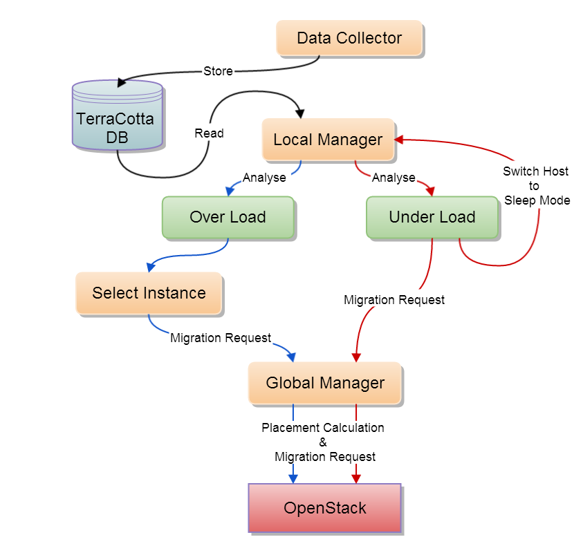

..
      Copyright 2015 Huawei Technologies Co. Ltd. All Rights Reserved.
      
      Licensed under the Apache License, Version 2.0 (the "License"); you may
      not use this file except in compliance with the License. You may obtain
      a copy of the License at

          http://www.apache.org/licenses/LICENSE-2.0

      Unless required by applicable law or agreed to in writing, software
      distributed under the License is distributed on an "AS IS" BASIS, WITHOUT
      WARRANTIES OR CONDITIONS OF ANY KIND, either express or implied. See the
      License for the specific language governing permissions and limitations
      under the License.

What is TerraCotta?
==============

**TerraCotta** is a **Dynamic Resource Consolidation** of instances in Openstack Clouds. **TerraCotta** is with reference to 
**Neat** programed by Anton Beloglazov in his Ph.D thesis "Energy-Efficient Management of Virtual Machines in Data Centers
for Cloud Computing", it is a total reconstructed and enhanced version of **Neat** in order to comply with OpenStack's 
standards and made more practical in futrue production environment usage.

   
   图: The overview of TerraCotta mission procedure.

Contents
--------
.. toctree::
   :maxdepth: 2

   overview
   install
   tutorial
   user_stories
   plugins
   contribute
   gates
   feature_requests
   project_info
   release_notes

